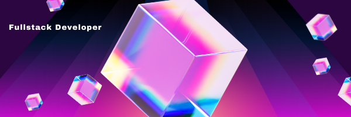

# Hi there 👋, my name is Florian Ginet

##  Full Stack Developer 

&nbsp;&nbsp;
 

Who am I? A developer, a passionate person, a perfectionist... who likes to code, to  
learn, to understand, to exchange, to look for, to convince but also a dad, a gamer who  
 likes challenges, things well done, problems to solve...

## Languages and Tools  

 
 
 

- 🔭 I’m currently working on this page. 
- 🌱 I’m currently learning TypeScript -  Nextjs- Docker  
- 📫 How to reach me: ginet.florian.dev@gmail.com

